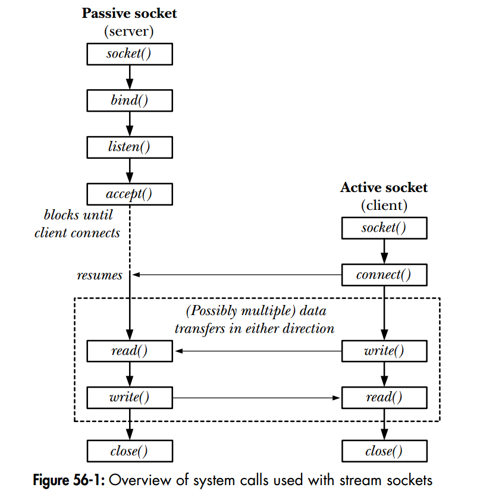

Client Server Model in Linux

http_tcpServer.cpp

- In constructor:
    - init all data including socket address
    - start server:
        - create the **socket** for ipv4 tcp
        - **bind** the socket to the socket address
    
Then listen is called:
- In startListen:
    - **listen** to the socket fd
    - infinite loop that accept connection
    - in **accept** connection it accept connection which creates a new socket 
    - **read** data from user
    - print http data
    - return response with **write**
    - **close** the new socket
